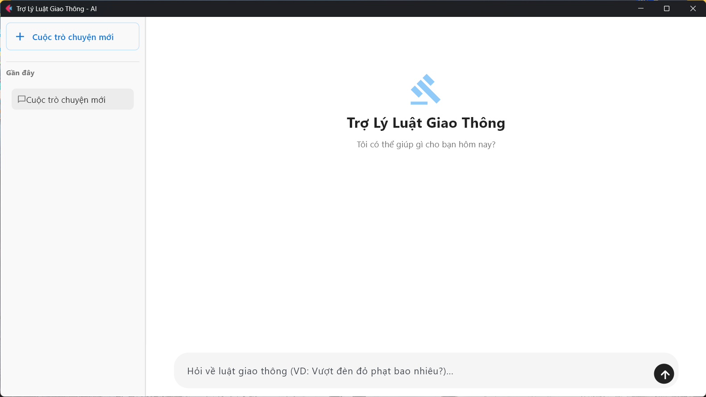
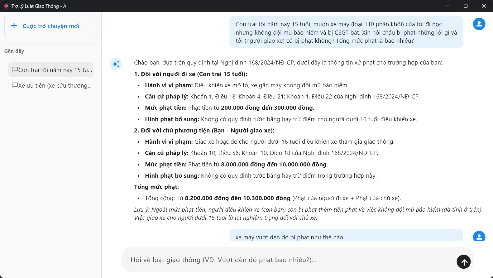

# Trợ Lý AI Tư Vấn Luật Giao Thông Đường Bộ (Offline)

Ứng dụng desktop Windows tích hợp kiến trúc **RAG (Retrieval-Augmented Generation)** chạy **100% offline**, hỗ trợ tra cứu và tư vấn các quy định, mức xử phạt vi phạm hành chính trong lĩnh vực giao thông đường bộ Việt Nam. Toàn bộ pipeline từ embedding, reranking đến sinh câu trả lời đều được thực thi cục bộ trên máy người dùng, không phụ thuộc vào API hoặc kết nối internet.

## Mục lục

- [Tổng quan](#tổng-quan)
- [Kiến trúc & Công nghệ](#kiến-trúc--công-nghệ)
- [Yêu cầu hệ thống](#yêu-cầu-hệ-thống)
- [Cấu trúc thư mục](#cấu-trúc-thư-mục)
- [Cài đặt & Chạy từ mã nguồn](#cài-đặt--chạy-từ-mã-nguồn)
- [Build ứng dụng thực thi (.exe)](#build-ứng-dụng-thực-thi-exe)
- [Khắc phục lỗi thường gặp](#khắc-phục-lỗi-thường-gặp)
- [Nguồn dữ liệu](#Nguồn-dữ-liệu)
- [Giấy phép & Ghi nhận](#giấy-phép--ghi-nhận)

## Tổng quan

Hệ thống cho phép người dùng đặt câu hỏi bằng ngôn ngữ tự nhiên về luật giao thông (mức phạt, thẩm quyền xử lý, thủ tục hành chính...) và nhận câu trả lời được trích dẫn trực tiếp từ văn bản pháp luật gốc (Nghị định, Luật), nhằm hạn chế tối đa hiện tượng "ảo giác" (hallucination) thường gặp ở các mô hình ngôn ngữ lớn.


 


**Tính năng chính:**

- Tư vấn pháp lý dựa trên dữ liệu PDF được nạp sẵn, trả lời bám sát ngữ cảnh truy xuất được.
- Viết lại câu hỏi (*query rewriting*) dựa trên lịch sử hội thoại, xử lý tốt các câu hỏi nói tắt, thiếu ngữ cảnh ("Thế xe máy thì sao?").
- Chuẩn hóa từ khóa pháp lý (*legal query generation*) để tăng độ chính xác khi truy xuất văn bản luật.
- Cơ chế re-ranking kết quả truy xuất bằng mô hình riêng, lọc theo ngưỡng độ liên quan.
- Quản lý nhiều phiên hội thoại (tạo, đổi tên, xóa), lưu trữ lịch sử bằng SQLite.
- Giao diện chat trực quan, dựng bằng Flet (Python), không yêu cầu trình duyệt hay runtime ngoài.
- Vận hành hoàn toàn offline: không gửi dữ liệu người dùng ra ngoài máy.

## Kiến trúc & Công nghệ

| Thành phần | Công nghệ sử dụng |
|---|---|
| Giao diện người dùng | [Flet](https://flet.dev/) (Python) |
| Suy luận LLM | [llama.cpp](https://github.com/ggml-org/llama.cpp) server (`llama-server.exe`, build Vulkan) |
| Mô hình ngôn ngữ | [Qwen3.5-4B](https://huggingface.co/unsloth/Qwen3.5-4B-GGUF) định dạng GGUF, lượng tử hóa Q4_K_M |
| Embedding | [Vietnamese Embedding model](https://huggingface.co/AITeamVN/Vietnamese_Embedding), suy luận qua ONNX Runtime |
| Reranking | [gte-multilingual-reranker-base](https://huggingface.co/Alibaba-NLP/gte-multilingual-reranker-base), suy luận qua ONNX Runtime |
| Vector Database | [Chroma](https://www.trychroma.com/) (qua `langchain_chroma`) |
| Orchestration RAG | [LangChain](https://www.langchain.com/) (`langchain_core`, `langchain_openai` — giao tiếp với llama-server qua giao thức tương thích OpenAI) |
| Trích xuất dữ liệu PDF | `PyMuPDFLoader` (langchain_community) |
| Lưu trữ lịch sử chat | SQLite3 |
| Đóng gói ứng dụng | PyInstaller |

**Luồng xử lý tổng quát:**

1. Câu hỏi người dùng → viết lại dựa trên lịch sử hội thoại (Query Rewriter).
2. Câu hỏi đã viết lại → chuẩn hóa thành cụm từ khóa pháp lý chuẩn (Legal Query Generator).
3. Truy vấn vector store (Chroma) để lấy top-k đoạn văn bản liên quan.
4. Re-rank kết quả bằng mô hình reranker, loại bỏ các đoạn có điểm liên quan dưới ngưỡng.
5. Đưa ngữ cảnh đã lọc + lịch sử hội thoại vào prompt hệ thống, sinh câu trả lời qua llama-server.
6. Lưu câu hỏi/câu trả lời vào lịch sử phiên chat (SQLite).

## Yêu cầu hệ thống

- **Hệ điều hành:** Windows 10/11 (64-bit)
- **CPU:** Intel Core i5 thế hệ 10 trở lên (hoặc tương đương)
- **RAM:** Tối thiểu 16 GB
- **GPU:** Không bắt buộc; khuyến nghị dùng GPU rời (GTX 1650, RTX 2060 trở lên) để tăng tốc suy luận qua Vulkan backend
- **Ổ cứng:** Tối thiểu 10 GB trống (cho mô hình AI và dữ liệu)
- **Python:** 3.12 

## Cấu trúc thư mục

```
THƯ_MỤC_DỰ_ÁN/
│
├── backend.py                          # Logic xử lý AI, RAG pipeline, quản lý session
├── config.py                           # Cấu hình đường dẫn, tham số, system prompt
├── ui.py                               # Giao diện người dùng (Flet) và entrypoint
├── requirements.txt                    
├── build.spec                          # Cấu hình build PyInstaller
│
├── data/                               # Tài liệu PDF nguồn (văn bản luật)
│
├── llama-b8644-bin-win-vulkan-x64/     # Runtime llama.cpp (build Vulkan)
│   └── llama-server.exe
│
└── models/                             # Mô hình AI (không kèm trong repo, xem mục bên dưới)
    ├── Qwen3.5-4B-Q4_K_M.gguf
    ├── Vietnamese_Embedding/
    │   └── onnx/
    │       └── model.onnx
    └── gte-multilingual-reranker-base_ONNX/
        └── model.onnx
```

> **Lưu ý:** Thư mục `models/`, `llama-b8644-bin-win-vulkan-x64/`, `chroma_db/` và `chat_history.db` không được đưa vào repository do dung lượng lớn hoặc chứa dữ liệu runtime. Cần tải/tạo riêng theo hướng dẫn dưới đây.

### Tải llama.cpp

Runtime suy luận LLM sử dụng [llama.cpp](https://github.com/ggml-org/llama.cpp). Tải bản build phù hợp (Vulkan, Windows x64) từ trang [Releases](https://github.com/ggml-org/llama.cpp/releases) của repository chính thức, giải nén vào thư mục `llama-b8644-bin-win-vulkan-x64/` (hoặc đổi tên tương ứng và cập nhật lại `LLAMA_SERVER_PATH` trong `config.py`).

### Tải mô hình AI

| Mô hình | Vai trò | Nguồn tải |
|---|---|---|
| `Qwen3.5-4B-Q4_K_M.gguf` | LLM sinh câu trả lời | [Tải về](https://huggingface.co/unsloth/Qwen3.5-4B-GGUF) |
| `Vietnamese_Embedding` (ONNX) | Embedding văn bản tiếng Việt | [Tải về](https://huggingface.co/AITeamVN/Vietnamese_Embedding) |
| `gte-multilingual-reranker-base_ONNX` | Re-rank kết quả truy xuất | [Tải về](https://huggingface.co/Alibaba-NLP/gte-multilingual-reranker-base) |

Sau khi tải, đặt đúng vị trí theo cấu trúc thư mục `models/` ở trên.

## Cài đặt & Chạy từ mã nguồn

### Bước 1 — Tạo môi trường ảo

```powershell
python -m venv venv
venv\Scripts\activate
```

### Bước 2 — Cài đặt thư viện

```powershell
pip install -r requirements.txt
```

### Bước 3 — Chuẩn bị mô hình & dữ liệu

Đảm bảo các thư mục `models/`, `llama-b8644-bin-win-vulkan-x64/`, `data/` đã được đặt đúng vị trí như mô tả ở [Cấu trúc thư mục](#cấu-trúc-thư-mục).

### Bước 4 — Khởi chạy ứng dụng

```powershell
python ui.py
```

Lần chạy đầu tiên, hệ thống sẽ tự động đọc tài liệu trong `data/`, tách đoạn (chunking) và khởi tạo vector database tại `chroma_db/`. Các lần chạy sau sẽ tái sử dụng database đã tạo, giúp khởi động nhanh hơn.

## Build ứng dụng thực thi (.exe)

### Bước 1 — Build bằng PyInstaller

```powershell
python -m PyInstaller build.spec --clean --noconfirm
```

### Bước 2 — Sao chép tài nguyên runtime vào thư mục build

PyInstaller chỉ đóng gói mã nguồn Python; các tài nguyên lớn (model, dữ liệu, runtime llama.cpp) cần được sao chép thủ công vào thư mục `dist/` sau khi build:

```powershell
xcopy /E /I /Y "models" "dist\TroLyLuatGT\models"
xcopy /E /I /Y "data" "dist\TroLyLuatGT\data"
xcopy /E /I /Y "llama-b8644-bin-win-vulkan-x64" "dist\TroLyLuatGT\llama-b8644-bin-win-vulkan-x64"
```

> Lưu ý phiên bản llama.cpp khi sao chép — tên thư mục phải khớp với giá trị `LLAMA_SERVER_PATH` cấu hình trong `config.py`.

**(Tùy chọn)** Sao chép sẵn `chroma_db/` đã được khởi tạo để bản đóng gói không phải tạo lại vector database khi chạy lần đầu:

```powershell
xcopy /E /I /Y "chroma_db" "dist\TroLyLuatGT\chroma_db"
```

Ứng dụng hoàn chỉnh sau khi build nằm tại `dist\TroLyLuatGT\`, có thể đóng gói/phân phối dưới dạng thư mục độc lập.

## Khắc phục lỗi thường gặp

| Lỗi | Nguyên nhân | Cách khắc phục |
|---|---|---|
| `FileNotFoundError` khi khởi động | Sai tên/vị trí thư mục, thiếu file `.gguf`/`.onnx`, hoặc thiếu `llama-server.exe` | Đối chiếu lại với [Cấu trúc thư mục](#cấu-trúc-thư-mục), đảm bảo tên thư mục khớp với `config.py` |
| `MemoryError` hoặc ứng dụng tự thoát | Không đủ RAM trống khi nạp mô hình | Đóng các ứng dụng/trình duyệt đang chiếm nhiều RAM, khởi động lại ứng dụng |
| Khởi động chậm bất thường lần đầu | Đang khởi tạo `chroma_db` từ tài liệu trong `data/` | Đây là hành vi bình thường; các lần chạy sau sẽ nhanh hơn. Có thể copy sẵn `chroma_db/` đã build để bỏ qua bước này |

## Nguồn dữ liệu

- **Dữ liệu huấn luyện/tra cứu (data/):** thu thập từ [Cổng thông tin điện tử Chính phủ](https://chinhphu.vn/) và [Thư viện Pháp luật](https://thuvienphapluat.vn/phap-luat/ho-tro-phap-luat/luat-giao-thong-2025-va-cac-nghi-dinh-thong-tu-huong-dan-moi-nhat-luat-giao-thong-2025-gom-cac-luat-939767-198964.html).
- **Dữ liệu kiểm thử:** sử dụng bộ dữ liệu công khai [Dataset TrafficLaw](https://www.kaggle.com/datasets/chngnguynminhhong/dataset-trafficlaw?resource=download) trên Kaggle.

> Dữ liệu chỉ phục vụ mục đích nghiên cứu/học thuật. Vui lòng kiểm tra lại tính cập nhật của văn bản pháp luật trước khi áp dụng vào thực tế.

## Giấy phép & Ghi nhận

- Mô hình suy luận sử dụng runtime [llama.cpp](https://github.com/ggml-org/llama.cpp) (giấy phép MIT).
- Vector store sử dụng [ChromaDB](https://www.trychroma.com/).
- Giao diện xây dựng bằng [Flet](https://flet.dev/).
- Dự án phục vụ mục đích nghiên cứu/học thuật. Vui lòng tham khảo giấy phép sử dụng của từng mô hình AI thành phần (Qwen, Vietnamese Embedding, gte-multilingual-reranker) trước khi triển khai cho mục đích thương mại.
